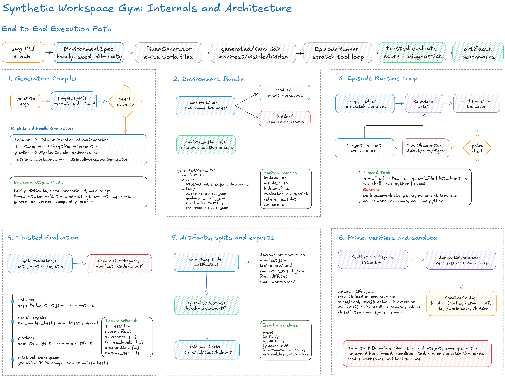

# Synthetic Workspace Gym scripts

This directory contains standalone entrypoints for rebuilding curricula, exporting calibration reports, validating generated retrieval surfaces, and building the sandbox images consumed by the taskset. The generation and evaluator libraries they call remain under `generators/synthetic_workspace_gym/`.

`agent.Dockerfile` bakes visible workspaces into one image per curriculum, preserving train/validation/evaluation boundaries. `grader.Dockerfile` defines the dedicated clean grader image. `build_images.py` requires a digest-pinned base, pushes every image privately by default, and records the completed Prime VM artifact ID and CAS path (or a registry digest on older Prime APIs). Public visibility requires the explicit `--public` flag.

